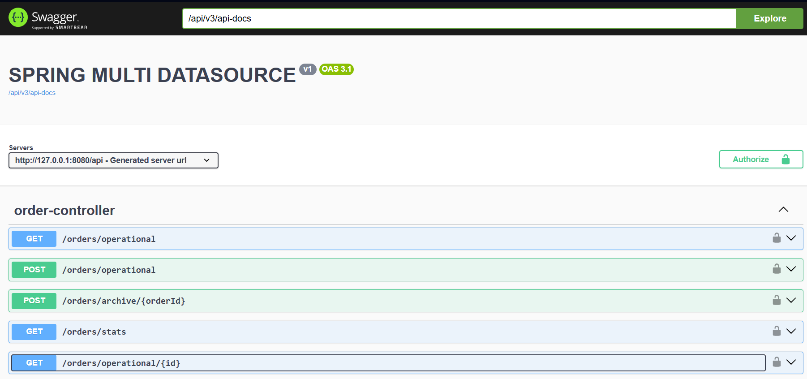

# Spring Boot Multi-DataSource (MySQL)

Ce projet est une démonstration technique montrant comment configurer et utiliser plusieurs sources de données (Multi-DataSource) avec Spring Boot, Spring Data JPA et Hibernate.

## 🚀 Contexte et Objectif

Dans de nombreuses architectures d'entreprise, il est nécessaire de séparer les données selon leur cycle de vie ou leur usage. Ce projet illustre un cas d'utilisation courant :
- **Base Opérationnelle** : Stocke les commandes actives et les produits.
- **Base d'Archive** : Stocke l'historique des commandes traitées pour soulager la base principale.

## 🛠 Technologies utilisées

- **Java 17+**
- **Spring Boot 3.x**
- **Spring Data JPA**
- **MySQL** (2 bases de données distinctes)
- **HikariCP** (Pool de connexions)
- **Lombok**
- **OpenAPI / Swagger** (pour tester les APIs)

---

## 🏗️ Étapes de Configuration

### 1. Configuration des propriétés (application.yml)

On définit deux configurations distinctes pour les sources de données sous des préfixes personnalisés.

```yaml
spring:
  datasource:
    # --- DataSource 1 : Base OPERATIONNELLE ---
    operational:
      url: jdbc:mysql://localhost:3306/event_management
      username: root
      password: your_password
      driver-class-name: com.mysql.cj.jdbc.Driver
    
    # --- DataSource 2 : Base ARCHIVE ---
    archive:
      url: jdbc:mysql://localhost:3306/event_management_archive
      username: root
      password: your_password
      driver-class-name: com.mysql.cj.jdbc.Driver
```

### 2. Organisation du code par Package

Pour isoler les configurations JPA, les entités et les repositories sont séparés dans des packages distincts :
- `com.tdsi.spring_multidatasource.entity.operational`
- `com.tdsi.spring_multidatasource.entity.archive`

### 3. Configuration Java des DataSources

Chaque source de données nécessite sa propre classe de configuration (`@Configuration`).

#### Points clés de la configuration :
- **`DataSourceProperties`** : Charge les propriétés depuis le fichier YAML.
- **`DataSource`** : Crée le bean de connexion.
- **`LocalContainerEntityManagerFactoryBean`** : Configure Hibernate pour scanner les entités du package dédié.
- **`PlatformTransactionManager`** : Gère les transactions pour cette source de données spécifique.
- **`@EnableJpaRepositories`** : Lie les repositories d'un package spécifique à l'EntityManagerFactory et au TransactionManager correspondants.

> 💡 **Note** : Une des deux sources doit être marquée comme **`@Primary`** pour servir de source par défaut.

---

## 💻 Utilisation dans le Code

### Repositories
Les repositories sont de simples interfaces Spring Data JPA, mais ils sont injectés avec le bon contexte grâce à la configuration par package.

### Services
Pour utiliser une transaction sur la base secondaire (Archive), il faut spécifier le TransactionManager :

```java
// Base opérationnelle (Primary)
@Transactional 
public void saveOrder(Order order) { ... }

// Base d'archive
@Transactional("archiveTransactionManager")
public void archiveOrder(ArchivedOrder archivedOrder) { ... }
```

---

## 🚦 Comment lancer le projet ?

1.  **Prérequis** : Avoir un serveur MySQL local.
2.  **Création des bases** :
    ```sql
    CREATE DATABASE event_management;
    CREATE DATABASE event_management_archive;
    ```
3.  **Configuration** : Modifiez le fichier `src/main/resources/application.yml` avec vos identifiants MySQL.
4.  **Lancement** :
    ```bash
    ./mvnw spring-boot:run
    ```
5.  **Tests** : Accédez à l'interface Swagger pour tester les endpoints :
    [http://localhost:8080/api/swagger-ui/index.html](http://localhost:8080/api/swagger-ui/index.html)
 

## 📖 Structure du Projet

```text
src/main/java/com/tdsi/spring_multidatasource/
├── config/              # Configurations Multi-DataSource
├── controller/          # Endpoints API
├── entity/
│   ├── operational/     # Entités base principale
│   └── archive/         # Entités base archive
├── repository/
│   ├── operational/     # Repositories base principale
│   └── archive/         # Repositories base archive
└── service/             # Logique métier orchestrant les 2 bases
```

## Liens

- [Son utilisation pour spring batch](https://github.com/jallowdev/spring-batch-event)

## Auteur

[Ibrahima Diallo](https://github.com/jallowdev)

Backend Engineer